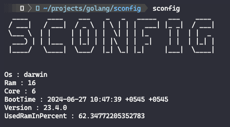

# SCONFIG



SCONFIG is a simple terminal-based Go application that displays system configuration information, including the operating system, total RAM, CPU cores, boot time, kernel version, and used RAM percentage. 

## Features

- Display the operating system.
- Show total RAM in gigabytes.
- Display the number of CPU cores.
- Show the system boot time.
- Display the kernel version.
- Show the percentage of used RAM.

## Requirements

- Go 1.16 or higher
- Git

## Setup

### Clone the Repository

```sh
git clone https://github.com/RoshanShrestha123/sconfig
cd sconfig
```

### Install Dependencies

This project uses several external packages. To install them, run:

```sh
go get github.com/RoshanShrestha123/sconfig/utils
go get github.com/common-nighthawk/go-figure
go get github.com/shirou/gopsutil/v4/cpu
go get github.com/shirou/gopsutil/v4/host
go get github.com/shirou/gopsutil/v4/mem
```

### Build the Project

Build the executable by running:

```sh
go build -o sconfig
```

### Move the Executable to a Directory in Your PATH

To run the `sconfig` command from anywhere in your terminal, move the executable to a directory that is included in your `PATH`.

For Unix-like systems (Linux, macOS):

```sh
sudo mv sconfig /usr/local/bin/
```

For Windows:

1. Open Command Prompt or PowerShell as Administrator.
2. Move the executable:

    ```sh
    move sconfig.exe "C:\Program Files\"
    ```

3. Add the directory to your PATH:

    - Open the Start Menu and search for "Environment Variables".
    - Click on "Edit the system environment variables".
    - In the System Properties window, click on the "Environment Variables" button.
    - In the Environment Variables window, find the `Path` variable in the "System variables" section and select it.
    - Click "Edit" and add the directory where you moved your executable (e.g., `C:\Program Files`).
    - Click "OK" to close all windows.

### Verify the Setup

Open a new terminal window and run:

For Unix-like systems:

```sh
sconfig
```

For Windows:

```sh
sconfig.exe
```

If everything is set up correctly, your program should display the system configuration information.

## Usage

Simply run the `sconfig` command in your terminal to see your system configuration.

```sh
sconfig
```

You should see output similar to the following:

```
SCONFIG
Os : linux
Ram : 8
Core : 4
BootTime : 2024-06-27 15:30:00 +0000 UTC
Version : 5.4.0-74-generic
UsedRamInPercent : 45.32
```
